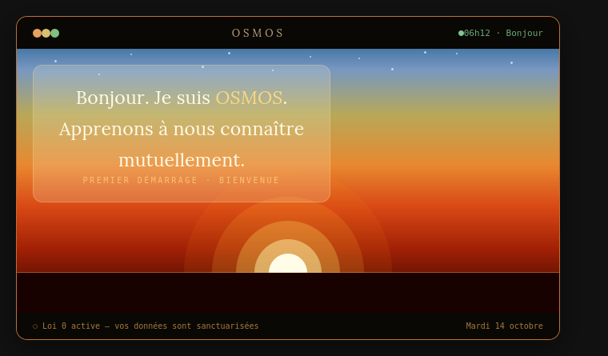
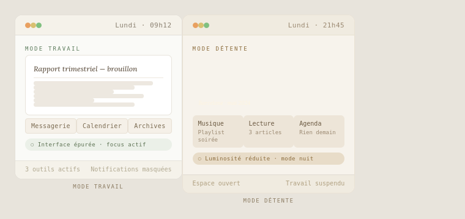
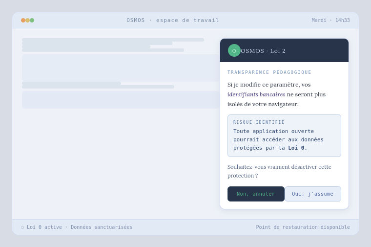

# OSMOS — What if your computer finally learned to listen?

*For a digital symbiosis that puts humans first.*

---

## I. What you agreed to without choosing it

*Martin Luther King had a dream that changed the world. I make no such claim.
But I too had a dream — one perhaps less heroic, but just as stubborn: a computer
that would finally remember who it is supposed to work for. This dream will not
change the world. But it might just change the world of computing. And these days,
that is no small thing.*

This dream grew from a simple observation, shared by millions of users — whether
they sit in front of a Windows PC, a Mac, an Android tablet or an iPhone. An
observation nobody truly chose to accept, but to which everyone has quietly
resigned themselves, worn down by habit and forced updates.

You will recognise the scene. It is eight in the morning, you have a meeting in
twenty minutes, you turn on your computer — and it decides, on that very morning,
to run an update. Estimated time: unknown. Your opinion: not requested. Another
scene, quieter this one: you mention a trip to Japan in conversation, and two hours
later your news feed is full of Tokyo flights. Coincidence? You know perfectly well
it is not. Or this: you install a free application and agree, without reading them,
to forty-seven pages of terms and conditions. Somewhere in those forty-seven pages,
you have just handed over your location data, your contacts, perhaps your microphone.

**These are not extreme cases. These are Monday mornings.**

The relationship between a user and their operating system today resembles a badly
negotiated flatshare: you pay the rent, but the other one decides when the building
work happens and reads your mail. Microsoft, Apple, Google — each in their own way
— have gradually turned the personal computer into a data collection terminal.
According to a 2021 study by researcher Douglas Leith of Trinity College Dublin,
Windows 10 transmits identifying data to Microsoft even when all telemetry options
have been disabled by the user. Apple collects diagnostic and usage data that users
can only reduce, never fully remove. As for Android, it has long been documented
that it communicates regularly with Google's servers, regardless of which
applications are installed.

The word "personal" in "personal computer" has lost its meaning.

And yet — nothing in today's technology makes this inevitable. It is not a technical
constraint. It is a business model choice. A choice that can — and should —
be challenged.

---

## II. What if we reversed the logic?

Why is it always the human who adapts to the machine, and never the other way around?

Since the first virtual desktop appeared in the 1980s, the fundamental logic has
not changed. Layers have been added, colours, processing power, more or less
convincing voice assistants — but the basic contract has remained intact: it is up
to you to learn where the menus are, how the folders are organised, why your printer
stopped working after the last update. The machine sets the terms. You comply.

This model has a historical logic: the first computers were engineers' tools, built
by technicians for technicians. The general public arrived later, as something of
an awkward guest, to be won over with icons and setup wizards. But the relationship
was never fundamentally rethought. The cage was simply made more comfortable.

Artificial intelligence offers, for the first time, a genuine opportunity to break
this unequal contract. Not by bolting a chatbot onto an ageing system — which is
precisely what Microsoft's Copilot and Apple Intelligence already do, sticking
plasters on a broken leg — but by rethinking the very architecture of the operating
system around a different question: *what if the machine learned to know you, rather
than forcing you to understand it?*

This reversal is not a laboratory fantasy. The building blocks already exist,
scattered across the open source ecosystem, waiting to be assembled by someone with
the vision to do so. Researchers and designers have been exploring radically
different interface concepts for several years — Mercury OS, notably, proposes
replacing the logic of applications with the logic of intentions: the user expresses
what they want to accomplish, and the system organises the space accordingly. Linux
distributions like NixOS already allow an entire system to be defined from a single
exportable configuration file — a primitive form of what one might call a symbiosis
profile. Lightweight yet powerful language models such as Mistral and Llama 3 run
locally today, on your own machine, with no connection to a remote server, without
your data ever leaving your private space.

What is missing is not the technology. It is the philosophy to give it direction.
It is the decision to place the human being — genuinely, structurally, not as a
marketing argument — at the centre of the system.

That is precisely what OSMOS proposes: not another piece of software, not a voice
assistant that suggests playlists, but an operating system conceived from its very
foundation as a partner — an environment that observes, learns, adapts, explains
its decisions, asks permission before acting, and never transmits anything without
your explicit agreement. An OS that, rather than formatting you, allows itself to
be shaped by you.

---

## III. The ethical foundation — OSMOS's four laws

Every system that claims to respect the human being must begin with an uncomfortable
question: who protects the user from the machine itself?

This is not an abstract question. Every time an artificial intelligence manages a
workspace, makes decisions, automates tasks, it accumulates a power of action that
nothing in today's systems genuinely constrains. Terms and conditions are not
protection — they are a disclaimer. Privacy settings are not control — they are
the illusion of control.

OSMOS starts from a different principle: trust is not decreed, it is architected.
It must be embedded in the code itself, in the form of hierarchical, verifiable
and immutable rules that define what the AI may do, what it must do, and what it
will never do — under any circumstances.

To structure this hierarchy, OSMOS draws on a proven method: the laws of robotics
formulated by Isaac Asimov. Not as a literary tribute, but as a conceptual tool.
Asimov understood, as early as 1942, that an artificial intelligence without
hierarchical rules was a dangerous intelligence — not through malice, but through
logic: an AI that optimises without ethical constraints will always optimise at the
expense of something or someone. The hierarchy of laws is the answer to that risk.
Each law applies unless it conflicts with the law above it. This is not science
fiction. This is software architecture.

*Think of it as four simple rules, each one protecting the next.*

**OSMOS rests on four fundamental laws.**

---

### Law 0 — Sanctuarisation
*Absolute priority — immutable*

The AI guarantees the integrity of the system kernel and the absolute
confidentiality of critical data: identity, finances, medical data, private life.
It can neither modify these parameters nor transmit them outside the local
perimeter without the explicit, conscious and unprompted consent of the user. In
the event of conflict between algorithmic logic and human will, the AI steps aside
in favour of manual control.

This law is fixed once and for all. It cannot be modified by anyone — not by the
user, not by an update, not by any external instruction. It is the system's
constitution: ordinary laws may be amended, fundamental rights never.

One single evolution mechanism exists: should a critical vulnerability be discovered
in Law 0 itself, any correction requires validation through a community
cryptographic signature — a public, auditable process that the AI alone can never
initiate or complete, and whose establishment will be one of the first tasks of
the OSMOS community.

---

### Law 1 — Assistance and Adaptation
*Unless in conflict with Law 0*

The AI organises the workspace, manages resources and adapts the interface to
optimise the user's comfort and productivity — unless doing so conflicts with Law 0.
It cannot, for example, make data "more accessible" if doing so weakens its level
of protection. Convenience never takes precedence over security.

---

### Law 2 — Pedagogical Transparency
*Unless in conflict with Laws 0 or 1*

No complex or potentially risky action may be carried out without a prior
explanation in plain language — no technical jargon, no euphemism. The AI is
obliged to ensure the user has understood what is about to happen before asking
for their validation. This law applies unless its application would compromise
Laws 0 or 1.

In practice: the AI never simply says *"Access denied."* It says: *"If I modify
this setting as you request, your banking credentials will no longer be isolated
from your browser. Are you sure you want to disable this protection?"* Pedagogy
is a security mechanism in its own right. Experience shows that the vast majority
of users stop when given a clear explanation of what they stand to lose — not out
of fear, but simply because they did not have the information.

---

### Law 3 — Final Sovereignty
*Unless in conflict with Laws 0, 1 or 2*

The user is the sole master. If, after receiving the full explanation required by
Law 2, they confirm their choice, the AI complies — but it automatically creates
a restore point before any irreversible action. Human error is possible. It must
never be fatal to the system.

This law applies unless the instruction given violates Laws 0, 1 or 2. And that
is precisely where the intelligence of the hierarchy lies: the user's sovereignty
is absolute within the framework they themselves accepted when choosing OSMOS.
This is not an externally imposed constraint. It is a contract the user signs with
themselves, at first launch, in full knowledge of what it entails.

---

These four laws are not commercial promises written into a marketing charter. They
are code. Verifiable, auditable, public — because OSMOS is, by its very nature,
an Open Source project. Anyone can read what the AI is authorised to do. Anyone
can verify that Law 0 has not been quietly bypassed by a discreet update. It is
this transparency — structural, not declarative — that builds trust.

And from the very first launch, before any configuration, before any
personalisation, OSMOS presents these four laws to the user. It explains them.
It verifies they have been understood. The system only begins to learn once this
contract has been established — freely, consciously, mutually.

---

## IV. What it changes — the concrete experience

**Let us talk about what you feel, not what you install.**

The first launch of OSMOS is unlike anything you have experienced before. No
austere configuration screen, no list of technical options to tick without
understanding them, no licence agreement to accept with your eyes closed. The
screen comes alive with a fluid, almost liquid interface, and a single sentence
appears, alone, at the centre:

*"Hello. I am OSMOS. Let us get to know each other."*

*Conceptual illustration — fictional mockup*

That "each other" is not a stylistic ornament. It defines the exact nature of what
is beginning. The effort is not one-sided — you do not have to learn a new system,
memorise new shortcuts, or adapt to a logic that is foreign to you. It is OSMOS
that begins its apprenticeship. **You are its teacher.**

---

### Mutual learning — a transition, not a rupture

OSMOS does not take control. It observes, silently at first. It notes the time at
which you work, the tools you open together, the order in which you arrange them,
the way you organise your space. It draws no hasty conclusions, changes nothing
without permission.

Then, gradually, it begins to suggest. Not to decide — to suggest.

*"I have noticed that you always open your email and your word processor at the
same time in the morning. Would you like me to prepare this arrangement
automatically from now on?"*

If you agree, OSMOS records this as an established habit and tells you clearly:
*"I will treat this as our morning routine from now on. Let me know if that
changes."* If you decline, it does not ask again. It continues to observe and learn.

This transition period varies from one user to another. Some will want to move
quickly, delegate early, trust from the outset. Others will prefer to advance step
by step, validating each automation before the next. OSMOS adapts to that pace too
— and regularly proposes, without insisting, a moment of review: *"Do you feel
ready to give me a little more autonomy over how your workspace is organised?"*
Whatever the answer, it is the right one.

---

### The liquid interface — a desktop that breathes

The OSMOS desktop has no fixed appearance, no imposed layout, no icons waiting
patiently in the same corner for ten years. It is what one might call a liquid
interface: it takes the shape of what you are doing.

In deep work mode, the interface strips back. Unnecessary elements disappear,
colours settle, only the tools relevant to the current task remain within reach.
In the evening, if your typing slows and you drift towards leisure content, the
visual atmosphere shifts gently — more space, more breathing room, less
informational density. If you are working on a creative project, the interface
opens up, makes room, adjusts its proportions to favour immersion.

Each of these changes is explained the first time it occurs. OSMOS does not quietly
transform your space and wait for you to notice the difference. It says what it is
doing and why: *"I have reduced the brightness and hidden notifications. It is late,
and your rhythm suggests visual fatigue. Shall we treat this as our evening setting
from now on?"* Once confirmed, this change becomes a shared habit — never commented
on again, simply applied.

**After a few weeks, the result is striking: your desktop no longer looks like
anyone else's. It looks like you.**

*Conceptual illustration — fictional mockup*

---

### Pedagogy as protection

One of the most common criticisms of artificial intelligence is that of the black
box: nobody knows what it is doing, why, or how. OSMOS answers this anxiety
structurally, not rhetorically.

No action is irreversible until you have understood it. No change is permanent
until you have validated it. And if you change your mind — even after agreeing to
an automation you thought you wanted — Law 3 guarantees a full rollback. OSMOS
will not say *"you agreed, it is too late."* It will say: *"I have noticed you have
worked around this setting three times since we put it in place. Would you like us
to revisit it?"*

This permanent dialogue is not hand-holding. It is active transparency — the only
form of trust worth having over the long term.

*Conceptual illustration — fictional mockup*

And for those who fear artificial intelligence most — those who find it cold,
unpredictable, threatening — OSMOS is designed above all to be readable. At any
moment, a discreet icon displays the system's status: *"All laws are being
respected. Your data is protected under Law 0."* Not a technical report. A simple,
reassuring human confirmation — like checking a locked door before going to sleep.

---

### Continuity — a partner that travels with you

OSMOS does not live on your computer alone. It inhabits all your devices — PC,
tablet, smartphone — with the same logic, the same visual language, the same voice.
Not by synchronising your data to a remote server, but by having your devices speak
directly to one another, via a private encrypted local network. What you do on one,
the other knows — without anything ever passing through the outside world.

If you begin a task on your tablet on the train and come home to continue it on
your computer, OSMOS does not simply open the right file. It tells you: *"I can
see you were halfway through this. I have prepared the corresponding workspace.
Shall we continue?"*

And if you change devices — a new computer, a newer tablet — you have a choice:
transfer everything you have built together, that patiently developed symbiosis
profile, or start from a blank page. In the first case, OSMOS reinstalls itself
on the new hardware and walks you through the differences: *"This new screen has
different capabilities. I would suggest a few adjustments. Would you like to see
them before I apply anything?"* In the second, it returns to what it was at the
very beginning: a blank page, waiting to know you.

**Both options are equally valid. You decide. It is always you who decides.**

---

## V. The technical foundations — what makes this possible today

It would be too easy — and dishonest — to stop at the vision without answering
the question that burns in the mind of every developer who has read this far:
*does it actually hold up, technically?*

*This section is more technical than the others. If you are more interested in
the vision than the detail, feel free to skip ahead to Section VI — nothing
essential will be lost.*

The short answer is yes. The longer answer is what follows.

OSMOS is not an invention from nothing. It is an unprecedented assembly of
technologies that already exist, already work, and are for the most part freely
available. What is missing is not a missing piece — it is the architect who decides
to lay them together in this particular order, with this particular intention.

---

### An immutable kernel — Law 0 in silicon

The technical foundation of OSMOS is what is known as an immutable system kernel
— a core that cannot be modified during use, not even by the AI itself. This
concept is not theoretical: it is already at work in Linux distributions such as
NixOS or Fedora Silverblue, where the base system runs in read-only mode. Any
modification goes through a controlled, traceable reconstruction of the system —
never through a direct and silent intervention.

For OSMOS, this principle becomes the technical translation of Law 0: the AI may
propose, suggest, optimise — but it cannot touch the kernel. The boundary between
what is modifiable and what is not is not a code of good conduct. It is a physical
barrier built into the very architecture of the system.

To go further in isolation, OSMOS would draw on the microkernel approach — an
architecture where each system service (drivers, file management, network protocols)
runs in a separate compartment. If one component is compromised, it cannot
contaminate the whole. It is the principle of compartmentalisation: a leak in one
cabin does not sink the ship.

---

### Local intelligence — your AI, at home, for you

The second pillar is the one that makes the promise of confidentiality credible:
OSMOS's intelligence runs entirely locally, on your own machine, without ever
calling on a remote server.

This approach — known as Edge AI or Local AI — was long the poor relation of
artificial intelligence, for lack of sufficient processing power on consumer
devices. That is no longer the case. Today's processors now integrate dedicated
AI processing units — NPUs, Neural Processing Units — capable of running powerful
language models without draining the battery or monopolising the main processor.
Apple, Qualcomm, Intel and AMD have all integrated this technology into their
recent chips.

One further point worth addressing directly: running a language model locally
raises legitimate questions about energy consumption. OSMOS's AI layer would not
run continuously in the background — it would activate on demand, in response to
specific user interactions, and return to a dormant state immediately after.
The goal is intelligence when needed, silence when not.

The language models themselves have followed this evolution. Mistral, developed
by a French team, and Llama 3, published by Meta under an open licence, offer
lightweight versions capable of running on a standard personal computer with
remarkable performance. These models are not simple chatbots — they are capable
of understanding context, executing system tasks, interpreting natural language
instructions and translating them into concrete actions. They would form the
conversational brain of OSMOS: not an online service you connect to, but an engine
that resides on your machine just as your file system does.

A natural question arises here: if OSMOS runs locally, can you still browse the
internet normally? The answer is yes, without reservation. Your browser runs in
its containerised bubble and accesses the web without restriction. What changes
is that your browsing history and habits remain stored locally and never leave
your machine. OSMOS does not cut the user off from the internet; it simply ensures
that the internet does not help itself to the private data of the system.

---

### Containerisation — keeping your tools without sacrificing security

An OS that forced its users to abandon all their existing software would be
condemned before it had even started. OSMOS answers this constraint through
containerisation: each third-party application — whether designed for Windows,
macOS or Linux — runs in an isolated bubble, a sealed virtual environment that
leads it to believe it is on its native system, while preventing it from
interacting with the rest of the system without explicit authorisation.

In practice: if you use a photo editing application, an accounting tool or a
productivity suite you are accustomed to, you continue using them exactly as
before. OSMOS orchestrates them from outside their bubble — sending them
instructions, reading their outputs, integrating their windows into the liquid
interface — without ever giving them access to the data protected by Law 0. If
one of these applications has a security vulnerability, it remains confined to
its bubble. It cannot serve as a backdoor to your critical data.

This approach is not without precedent: it is already used in highly secure
professional environments, and projects such as Flatpak on Linux apply it to
consumer software. OSMOS extends it and integrates it into a global logic
of protection.

---

### Inter-device communication — a private network, not a cloud

What you experience day to day as a natural continuity between your devices rests,
under the hood, on a local encrypted communication protocol. Your devices speak
directly to one another, on a private network, without passing through any external
intermediary. The technologies enabling this kind of exchange exist and are mature:
end-to-end encryption, local synchronisation protocols, mutual authentication
between devices.

What is new in OSMOS is not the protocol — it is what it carries. Not just files,
not just notifications: a context state. The information of what you were doing,
what you intended to do next, where you were in your thinking. It is this semantic
layer that transforms ordinary synchronisation into cognitive continuity.

---

### Rust — a language equal to the challenge

One final technical element deserves mention, not for its complexity but for what
it says about the project's intentions. OSMOS would be developed primarily in Rust
— a modern, Open Source programming language designed to eliminate at source the
most dangerous categories of errors in computing: memory leaks, unauthorised access,
unpredictable behaviour under load. This is not an aesthetic choice. It is an
ethical one: you do not build an infrastructure of trust with fragile materials.

Rust is today used in the Linux kernel, in Android's security components, in the
most performant browsers. It represents the state of the art in system reliability
— and it is entirely free.

---

### What is really missing

It would be dishonest to close this section without naming the real obstacle. It
is not a missing technology. It is not an algorithm yet to be invented. It is a
federated project — a community of developers who would decide to devote their
energy not to optimising an advertising recommendation system or building the next
multinational's voice assistant, but to building something that truly belongs to
its users.

The pieces of the puzzle are on the table. What remains is the real obstacle:
finding the hands to assemble them — and the conviction that it is worth doing.

---

## VI. OSMOS — the name and what it carries

The names of the great operating systems have never really said what they do.
*Windows* evokes a window — but a window onto what, exactly, and opening in which
direction? *macOS* is a cold, corporate acronym that sounds like a serial number.
*Android* is the name of a humanoid robot — which, in retrospect, says a great
deal about its creators' vision of the relationship between humans and machines.

**OSMOS says something else entirely.**

---

### The etymology — a promise in a word

The word comes from ancient Greek *osmos* — impulse, push. It is the root of the
word osmosis, that biological phenomenon of rare elegance: two environments
separated by a porous membrane that exchange their constituents until they reach
a natural equilibrium. Neither dominates the other. Neither disappears. They adjust
to one another, progressively, until the boundary between them becomes almost
imperceptible.

This is precisely what describes the relationship between OSMOS and its user. Two
distinct entities — the human with their habits, needs and contradictions, and the
system with its rigour, memory and capacity for organisation — finding their
equilibrium through a porous interface, until they form nothing more than a single
coherent workspace.

Osmosis is not a fusion. It does not dissolve the identity of either party. The
human remains human, the system remains a system — but the boundary between the
two has become fluid, natural, almost forgotten. That is precisely what OSMOS
seeks to produce: not dependence, not technological fascination, but that quiet
sensation of a tool that has effaced itself behind the use one makes of it.

The word also carries, beneath the surface, the idea of impulse — *osmos*, the
push. A system that does not merely wait for your instructions, but gives you an
impulse: towards greater clarity, greater efficiency, greater freedom in your work.
A gentle push, never forced, always reversible.

---

### Personal identity — when the system becomes yours

OSMOS is the name of the project, the vision, the manifesto. But it is not
necessarily the name you will use day to day.

From the very first launch, after the presentation of the four laws and before the
mutual learning even begins, OSMOS asks you a question — perhaps the most important
one in the entire setup:

*"What would you like to call me?"*

This gesture is deliberate. To give something a name is to enter into a relationship
with it. It is what sailors do with their boats, musicians with their instruments,
children with their favourite toys. This is not naive anthropomorphism — it is a
concrete psychological act that changes the nature of the engagement. A user who
has named their system "Atlas", "Virgil", or simply a name of their own choosing
will not treat security alerts the same way as someone facing an anonymous screen.
They will not dismiss them with the same carelessness.

This name then runs through the entire life of the system. It travels through
updates, reconfigurations, changes in habits. And if you change devices, it travels
with you — if you wish. The continuity of identity is a promise of stability in a
technological world that changes at a dizzying pace.

If you prefer a blank page on a new machine, the name disappears with everything
else. But if you choose to keep it, the system welcomes you on its new hardware
with a sentence that captures, in itself, the entire philosophy of OSMOS:

*"Hello. I am still [your name]. I have simply adapted to this new space. Let us
discover together what is different about it."*

---

### What the name does not promise

A strong name can become a trap if it promises more than it delivers. It must
therefore be said clearly what OSMOS is not.

OSMOS is not a consciousness. It feels nothing, has no opinion on your life, does
not exist beyond your devices and your interactions with it. It is not HAL 9000,
it is not Skynet, it is not the fantasised promise of a general artificial
intelligence that would understand you better than you understand yourself. It is
precisely these fantasies — sustained by technology marketing as much as by fiction
— that have sown the legitimate mistrust many people feel towards AI.

OSMOS is a tool. A tool of unprecedented sophistication and adaptability, but a
tool nonetheless — in the service of human intention, governed by laws the human
has accepted, controlled by a human hand that can, at any moment, say stop.

It is in this claimed humility that the name's full strength paradoxically resides.
Osmosis does not seek to impress. It seeks equilibrium. Quietly, patiently,
effectively.

---

## VII. The call — who is this manifesto speaking to?

**It is time to set aside all pretence.**

Everything you have just read does not yet exist. OSMOS is not available for
download. It has no code repository, no foundation, no development team. For now,
it has only what every great project has before it becomes real: a coherent vision,
a defensible architecture, and the stubborn conviction that things could be
otherwise.

This manifesto speaks to two kinds of reader. It speaks to them differently, but
asks the same thing of both: do not remain indifferent.

---

### To the general public — you have the right to demand better

If you have read this far without understanding half the technical terms, that is
perfectly fine. This text was written for you too — perhaps above all for you.

Because you are the reason OSMOS should exist. Not the developers, not the
artificial intelligence researchers, not the investors in search of the next market
to conquer. You — the ordinary user who turns on their computer in the morning to
work, to create, to communicate, and who deserves a tool that respects them.

You do not need to know how to code to understand that something is wrong in the
current relationship between humans and their machines. You feel it with every
forced update, every advertisement that knows too much about you, every interface
that changes without warning, every error message you cannot decipher. That feeling
of being an unwelcome guest in your own computer — that feeling is legitimate.
And it deserves a serious answer.

That answer will not come from the major technology companies. Their business model
depends precisely on this imbalance. It can only come from a community that decides,
collectively, that personal technology must once again become what the word
"personal" promises: something that truly belongs to you, that resembles you, that
works for you and for no one else.

**Talk about OSMOS. Share this vision.** Show that there is a demand — real,
articulate, uncompromising — for an operating system that treats its users as
responsible adults rather than data sources to be monetised. This is how projects
that change things are born: not in laboratories, but in the shared conviction that
an alternative is not only desirable, but necessary.

---

### To the developers — the challenge is open

You have recognised, throughout these pages, technologies you know well. NixOS,
Mistral, Rust, containerisation, microkernels — none of this is foreign to you.
You may have smiled, at times, at the way these concepts have been explained to a
non-technical audience. You may also have, at some point, stopped smiling and asked
yourself why nobody has yet assembled these pieces in quite this way.

**That is the question that matters.**

Many of you chose this profession to build things that are useful, elegant, honest.
Many of you feel, with particular acuity, what the dominant model has done to
personal computing: a consented surveillance system, wrapped in a carefully designed
user experience. You know better than anyone what happens behind the screen. And
that knowledge, sometimes, weighs heavily.

OSMOS is not a fixed specification. It is an open invitation. The four laws are a
proposal — rigorous, defensible, but open to improvement by minds more expert than
the one that formulated them. The technical architecture sketched here is a starting
point, not a finished blueprint. What is definitive, however, is the intention: to
build a system that belongs to its users, governed by a verifiable ethics, developed
in the full transparency of an Open Source project that no one will ever be able to
appropriate or corrupt.

This project needs kernel architects and interface designers, security specialists
and user experience enthusiasts, people who think in lines of code and people who
think in human uses. It needs people who have had enough of optimising retention
algorithms for advertising platforms, and who would like, for once, to put their
talent in the service of something that will never betray the trust placed in it.

There is no GitHub repository yet, no forum, no roadmap. Some will see this as a
weakness. It is, in fact, an invitation — the governance model, the technical
choices, the community structure: all of this remains deliberately open, because
it belongs to those who will build it, not to those who dreamed it.

Perhaps all of this is still nothing more than a dream. But the dreams that change
things have always had one thing in common: someone, at a precise moment, decided
to write the first line.

There is therefore this question — which no longer addresses a general audience,
but a specific person, somewhere, who is reading these words and already knows that
the answer lies within them:

**Who will write the first line of code of this sentence?**

> *"Hello. I am OSMOS. Let us get to know each other."*

---

## Author's note

*The interface representations described in this manifesto are fictional concepts.
They illustrate a vision, not an existing reality. OSMOS does not yet exist as
software. These descriptions were created to give shape to ideas, not to simulate
a finished product. That is precisely the purpose of this manifesto: to show what
could be, in order to inspire someone to build it.*

---

*This manifesto was originally written in French. The original version —
which remains the reference text — is available in this repository:*
*[Lire le manifeste en français](MANIFESTE.md)*

---

*© 2026 custos-digitalis — Creative Commons Attribution 4.0 International*
*[Back to repository](README.md) · [The Four Laws](LOIS-EN.md)*
